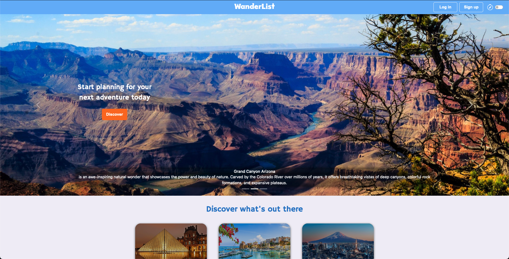

[](https://opensource.org/licenses/MIT)    


#  WanderList

## Description

Explore the world of travel dreams! Our website lets you create your own personalized travel wishes and discover inspiring blog posts from fellow adventurers. Save the ideas that captivate you, mark your travel accomplishments, and build a profile filled with unforgettable experiences. Start your journey with us today!

---
## Table of Contents
* [Description](#description)
* [Deployed Site](#deployed-site)
* [Preview](#preview)
* [Technologies Used](#technologies-used)
* [Installation](#installation)
* [Usage](#usage)
* [Project Status](#project-status)
* [User Story](#user-story)
* [Acceptance Criteria](#acceptance-criteria)
* [Contact](#contact)
* [License](#license)


---
## Installation

### Prerequisites
* [Node.js](https://nodejs.org/en/)
* [mySQL](https://www.mysql.com/)

### Local Installation
If you would prefer to see a local version of the site, follow the steps below:

1. Clone the repository to your local machine.
2. Navigate to the root directory of the cloned repository in your terminal.
3. Run `npm install` to install the dependencies.
4. Create a `.env` file in the root directory of the cloned repository.  An example of the contents of the `.env` file is shown below:
    ```
    DB_NAME=wanderlist_db
    DB_USER=root
    DB_PW=your_password
    SECRET=your_secret
    ```
5. Create the database by logging into mySQL and running `source db/schema.sql`.
6. Seed the database by running `npm run seed`.
7. Start the server by running `npm start` or `npm run nodemon` if you have nodemon installed.
8. Navigate to `http://localhost:3001` in your browser to view the site.

### Deployed Site

Explore [WanderList](https://wanderlist.herokuapp.com/) using our Heroku deployment!  

---
## Preview

<p align="center"><kbd> </kbd></p>

---
## Technologies Used

* [jQuery](https://jquery.com/) - A JavaScript library designed to simplify HTML DOM tree traversal and manipulation, as well as event handling, CSS animation, and Ajax.
*  [bootstrap v5.2](https://getbootstrap.com/docs/5.2/getting-started/introduction/) - A popular front-end framework that provides a collection of pre-built CSS and JavaScript components for responsive web design.
*  [handlebars v4.7.7](https://handlebarsjs.com/) - Template engine for rendering dynamic HTML templates.
* [mySQL](https://www.mysql.com/) - Open-source relational database management system.
*  [bcrypt v5.1.0](https://www.npmjs.com/package/bcrypt) - Password hashing and encryption for enhanced security.
*  [sequelize v6.31.1](https://sequelize.org/) - ORM (Object-Relational Mapping) for interacting with relational databases in an object-oriented manner.
*  [connect-session-sequelize v7.1.6](https://www.npmjs.com/package/connect-session-sequelize) - Integration of session management with Sequelize for persistent session storage.
*  [express v4.18.2](https://www.npmjs.com/package/express) - Web application framework for building server-side applications.
*  [express-handlebars](https://www.npmjs.com/package/express-handlebars) - Templating engine for rendering dynamic HTML templates.
*  [express-session v.17.3](https://www.npmjs.com/package/express-session) - Middleware for managing session data in Express.
*  [mysql2 v3.3.1](https://www.npmjs.com/package/mysql2) - MySQL database driver for Node.js.
*  [nodemon v2.0.22](https://www.npmjs.com/package/nodemon) - Development tool for automatically restarting the server during code changes.
*  [dotenv v16.0.3](https://www.npmjs.com/package/dotenv) - Loading environment variables from a .env file.
* [Heroku](https://www.heroku.com/) - Cloud platform for deploying and managing applications.

---
### Usage

To access our website, simply click on the provided link, and for an enhanced experience, we recommend creating an account to unlock all of our website's features. To create an account, click on the "Sign Up" button located in the top right corner, and complete all the required fields. Once your account is successfully created, you will gain access to create your own personalized travel wish list, explore inspiring blog posts from fellow adventurers, and save your favorite blog posts to your account using the "Pin" icon, marking your own travel accomplishments.

---
### User Interface

Text will go here...

---
## Credits
### Resources

The below resources contributed to the project.

#### Fonts

- Font Links will go here.

#### Images

- [Favicon Converter](https://favicon.io/favicon-converter/) provides a simple way to take any image and convert it to a favicon.  The favicon for this project was created from [this](https://www.flaticon.com/free-icons/compass) compass image created by Dimitry Miroliubov on [FlatIcon](https://www.flaticon.com/).

- [Icons8](https://icons8.com/icons/) provide simple images and icons.
  - [Blank Avatar Image](https://icons8.com/icon/65342/customer)
  
- [Matt Visiwig](https://twitter.com/MattVisiwig) created an SVG background creator that provides many free options.  The background image was created from [this](https://www.svgbackgrounds.com/) tool.

- [Shields.io](https://shields.io/) provides the badges for the README.

- [Dighital](https://dighital.com/icon-pack/icons/flat-icons/travel-people-icons/) icons were purchased for the avatar images.

#### Templates / Libraries

- [SimpleBar](https://github.com/Grsmto/simplebar) is a custom scroll bar library that allows for replacing the default browser scroll bars.

- [Ian Lunn](https://github.com/IanLunn) created an awesome library called [Hover.css](https://twitter.com/davidmacd) that adds some plug and play css animation classes.  We used this for some of the moving icons on the page.

- [CodyHouse](https://codyhouse.co/) provides a lot of free resources for web developers.  We used their [Login Modal](https://codyhouse.co/gem/loginsignup-modal-window/) for the login/signup functionality.

#### Data

- [ChatGPT](https://chat.openai.com/) is a chatbot that uses GPT-3 to generate responses.  The chatbot was used to come up with the site name.

### Educational
#### Blog Posts

Here are several blogs:

- [StackOverflow](https://stackoverflow.com/) provided guidance for troubleshooting the project.  Below are the links to key posts that contributed to our success:
  - [Regular Expressions for Validation](https://stackoverflow.com/questions/4244109/regular-expression-to-accept-only-characters-a-z-in-a-textbox)
  - [Using #each in Handlebars templates](https://stackoverflow.com/questions/21814888/access-values-using-each-in-a-one-dimensional-array)
  - [Bootstrap Modal Class Issues](https://stackoverflow.com/questions/44609680/close-button-on-modal-not-working-what-am-i-doing-wrong)
  - [Editting Bootstrap Popovers](https://stackoverflow.com/questions/54337652/how-can-i-change-the-color-of-bootstrap-popover-arrows)
  - 

#### Tutorials

- Tutorial Links will go here...
  
### Collaborators

- Olena Pashchenko - [UserOlena](https://github.com/UserOlena)
- Jennifer Rytikoff - [jenryt](https://github.com/jenryt)
- Bandhavi Bendi - [bbandhu](https://github.com/bbandhu)
- Kevin Small - [kevrev](https://github.com/Kevrev)
- Joshua Dempe - [JDempe](https://github.com/JDempe)

## License

Refer to the LICENSE in the repository.

## How to Contribute

Looking to contribute?  Find out how at https://github.com/JDempe/WanderList!
